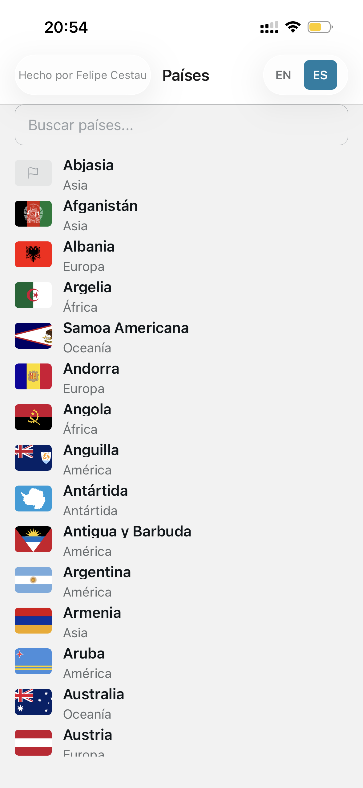
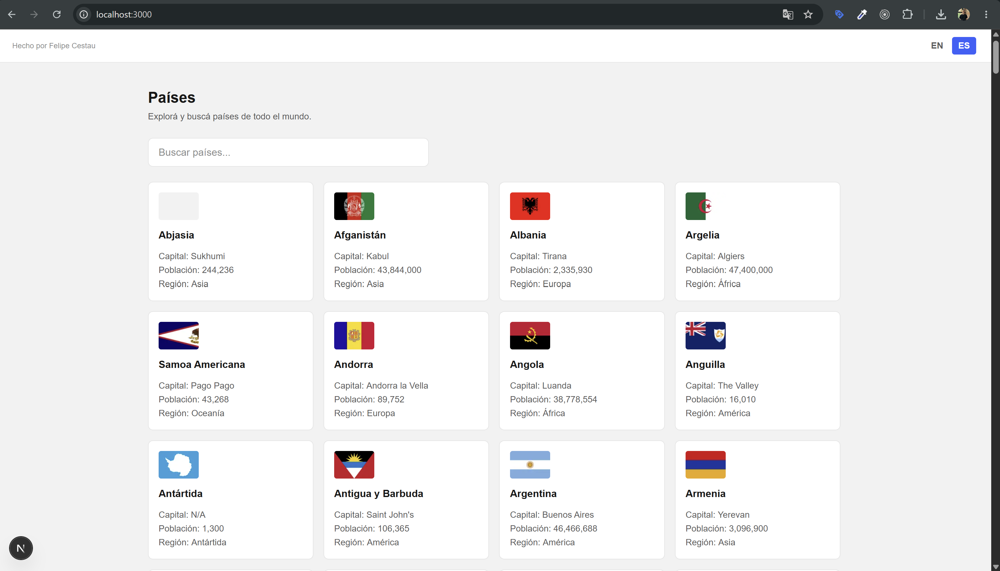
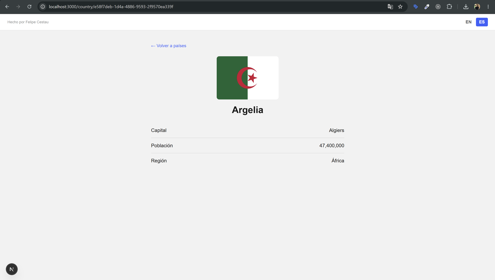

# Countries Explorer

Monorepo with a **mobile** app (Expo / React Native, main focus) and a **web companion** (Next.js), both consuming the public [REST Countries](https://restcountries.com) API to list, search, and view country details.

## Screenshots

| Mobile — list | Mobile — detail |
|---|---|
|  |  |

| Web — list | Web — detail |
|---|---|
|  |  |

## Stack and versions

| | Version used |
|---|---|
| Node | v22.16.0 |
| npm | 11.4.1 |
| Expo SDK | 54 (`expo ~54.0.35`, `react-native 0.81.5`) |
| Next.js | 16.3.1 (App Router) |

Requirement: **Expo Go** on your phone must be the build matching SDK 54 (if your Expo Go is older, the app won't open — update it from the store).

## 1. Get an API key

This project uses **REST Countries v5** (`api.restcountries.com`), not v3.1: v1–v4 are deprecated and v5 requires authentication.

1. Create a free account at [restcountries.com/docs/api-versions](https://restcountries.com/docs/api-versions) (free tier: 500 requests/month).
2. Copy your API key.

## 2. Install

From the repo root:

```bash
npm install
```

This installs the dependencies for `shared/`, `mobile/`, and `web/` in one go (npm workspaces).

## 3. Environment variables

Copy each app's `.env.example` and fill in the key you got in step 1. These files are **never committed** (they're in `.gitignore`).

**`web/.env`** (server-only, never reaches the browser bundle):
```bash
cp web/.env.example web/.env
```
```
RESTCOUNTRIES_API_KEY=your_key_here
```

**`mobile/.env`**:
```bash
cp mobile/.env.example mobile/.env
```
```
EXPO_PUBLIC_RESTCOUNTRIES_API_KEY=your_key_here
```

> ⚠️ **Accepted trade-off**: on mobile, the key uses the `EXPO_PUBLIC_` prefix, which means Expo inlines it directly into the client JS bundle — it's visible to anyone who inspects the installed app. This is an inherent limitation of not having a backend on mobile; on web we avoid this (see the technical decisions section).

## 4. Run the apps

**Mobile** (with Expo Go on your phone, same Wi-Fi as your computer):
```bash
npm run mobile
# or: cd mobile && npx expo start
```
Scan the QR code with Expo Go.

**Web**:
```bash
npm run web
# or: cd web && npm run dev
```
Open [http://localhost:3000](http://localhost:3000).

## 5. Tests

```bash
npm test
```

Runs the tests for `shared/` (mapper, formatter, filter, pagination) and `mobile/` (UI states) across all workspaces. Without the API key set as an environment variable, the live-integration test (`shared/src/services/countriesApi.integration.test.ts`) **skips itself automatically** — everything else has no network dependency.

To also run it (optional, validates against real data):
```bash
cd shared && RESTCOUNTRIES_API_KEY=your_key npx jest countriesApi.integration
```

## Project structure

```
countries-explorer/
├── shared/          # types, API service, mapper, formatters, filter, debounce — no runtime dependencies
├── mobile/          # Expo Router: app/index.tsx (list) + app/country/[id].tsx (detail)
└── web/             # Next.js App Router: app/page.tsx (list) + app/country/[id]/page.tsx (detail)
```

## Technical decisions

| Decision | Detail |
|---|---|
| **API v5, not v3.1** | REST Countries v1–v4 are deprecated. v5 lives at `api.restcountries.com`, requires `Authorization: Bearer <key>`, and paginates results (max 100/page on the free tier). `shared/src/services/countriesApi.ts` paginates automatically until `meta.more` is exhausted. |
| **Key hidden on web, exposed on mobile** | The `web/app/api/countries/route.ts` route handler fetches REST Countries **server-side** (the key never reaches the browser) and caches the response for 24h. The web client only hits `/api/countries`, same origin. Mobile has no backend of its own, so the key stays in the bundle (see trade-off above). |
| **`uuid` as the identifier, not `cca3`** | 4 out of 254 countries/territories (Abkhazia, Northern Cyprus, Somaliland, South Ossetia) have no ISO alpha-3 code. The `uuid` the API returns is always present, so it's used as the `key` for lists (`FlatList`/`.map`) and as the dynamic route param for `/country/[id]` in both apps. |
| **Bilingual search** | The API exposes `names.translations.spa.common` (Spanish name). `Country.nameEs` stores it, falling back to the English name when no translation exists. `filterCountriesByName` matches against both names, accent- and case-insensitive. The displayed country name also switches with the active language in both apps (`getLocalizedCountryName`). |
| **Regions translated, but fixed** | The 6 possible regions (`Africa`, `Americas`, `Antarctic`, `Asia`, `Europe`, `Oceania`) are translated with the shared `regions.*` i18n keys — they don't come from the API, they're static app content. |
| **Web i18n (EN/ES)** — optional plus | The spec calls out web i18n as an optional plus; implemented as a minimalistic client-side setup. All static UI copy in both apps — including this "Made by" credit — comes from `shared`'s translation files, so there's one source of truth instead of two parallel copies. i18n *configuration* stays platform-specific: AsyncStorage + `expo-localization` on mobile, `localStorage` + `navigator.language` on web (checked in that order — a stored preference wins, otherwise the browser's language). No localized routes, no middleware, no `next-i18next`, no SSR of translations — everything resolves client-side after mount, consistent with the app's client-side data fetching. |
| **PNG in lists, SVG in detail (mobile)** | REST Countries' SVG flags ship without a `viewBox`, so `SvgUri` was cropping them instead of scaling when asked for a size different from the original. `mobile/components/country-flag.tsx` fetches the XML itself and injects a `viewBox` derived from its own `width`/`height` before rendering it with `SvgXml`. The list uses PNG instead (lighter, unaffected by this issue) via `expo-image`. If a flag is missing or fails to load, a placeholder is shown. |
| **React Query, `staleTime: Infinity`** | The country dataset is static within a session: fetched once and cached. Mobile and web reuse the same query key (`['countries']`) between the list and the detail screen — if you've already visited the list, the detail screen doesn't fetch anything again. |
| **Shared debounce** | `shared/src/utils/debounce.ts` is a framework-agnostic debounce (no React dependency). Each app wraps it in its own hook (`useDebouncedValue`) since a hook needs React, and `shared` stays free of runtime dependencies. |
| **No pagination / no global state** | The dataset (~254 countries) is small and fixed: a single fetch plus in-memory filtering is enough. There's no Zustand/Context since there's no shared state that would justify it. |
| **Single React copy on mobile** | In this monorepo, `mobile/package.json` pins the exact React version Expo SDK 54 expects, but other npm-hoisted dependencies (e.g. `expo-router`) could resolve a different copy (the one `web/` asks for). That caused two React instances in the same Metro bundle and broke internal hooks. `mobile/metro.config.js` forces `react` to always resolve from `mobile/node_modules/react`. |

## What logic is shared (`shared/`)

- **Types**: `RawCountry` (API shape), `Country` (domain model).
- **Service**: `fetchAllCountries` — paginates against REST Countries v5.
- **Mapper**: `mapRawCountryToCountry(s)` — from `RawCountry` to `Country`, with fallbacks (capital `N/A`, Spanish name = English name when no translation exists).
- **Utils**: `filterCountriesByName` (bilingual, accent-insensitive search), `formatPopulation` (`Intl.NumberFormat`), `debounce`, `getLocalizedCountryName`.
- **Constants**: `BASE_URL`, `RESPONSE_FIELDS`, `PAGE_LIMIT`, `SEARCH_DEBOUNCE_MS`.
- **i18n**: `en`/`es` translation JSONs (`shared/src/i18n/locales/`) — the single source of truth for UI copy in both apps. Each app owns its own i18n *configuration* (language detection, persistence): mobile uses `expo-localization` + AsyncStorage, web uses `localStorage` + `navigator.language`.

Mobile and web both import all of this from `shared` — zero duplicated domain logic between platforms. What's **not** shared (by design, not by oversight) are the UI components: React Native and web patterns are different, so each app has its own (`CountryCard`, `SearchBar`, `LoadingState`, `EmptyState`, `ErrorState` exist in both folders, but as independent implementations).

## Accepted trade-offs

- **API key visible in the mobile bundle**: unavoidable without a backend of its own (see section 3). Documented, not hidden.
- **500 requests/month free tier**: mitigated with `staleTime: Infinity` in React Query (a single fetch per session) and a 24h cache in the web route handler.
- **`uuid` instead of `cca3` in URLs**: detail routes are less readable (`/country/0e1bae13-...` instead of `/country/ESP`), but it's the only way for the 4 territories without an ISO code to have a working detail page.
- **No dark mode on web**: settled on a single light theme (gray `#f2f2f2` background + white cards) after finding that the original adaptive scheme caused some flags (white or very dark ones) to blend into the background in dark mode.
